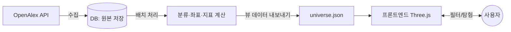

# 아키텍처 — 학술 우주 (OpenAlex)

핵심 원칙: **"느린 일"과 "빠른 일"을 분리한다.**
- 느린 일(수집·분류·좌표 계산) = **미리 한 번 배치로** 해서 결과를 저장.
- 빠른 일(사용자 필터·탐험) = 저장된 결과를 **즉시** 읽어 반응.

이렇게 하면 사용자는 빠르고, 서버 비용은 거의 0(정적 파일로 배포 가능).

## 전체 파이프라인



## 레이어별 역할

### 1) 수집기 (Fetcher)  — 느림, 가끔 실행
- OpenAlex API로 논문 **메타데이터** 수집: 제목, 초록, 연도, 인용수, `counts_by_year`(연도별 인용), `concepts`(분야), `referenced_works`(참고문헌=엣지), 저자, OA여부, (가능하면) 임베딩.
- 분야/키워드/연도 범위를 **설정 파일**로 지정(`fields.json`).
- 주의: 커서 페이지네이션, 레이트리밋 준수, polite pool(요청에 이메일 넣기).
- 주기 갱신(예: 주 1회) → 인용수·모멘텀 최신화.

### 2) 저장소 (DB)  — 원본+가공 보관
- 시작은 **SQLite 한 파일**(또는 JSON). 커지면 Postgres.
- 테이블(예):
  - `papers(id, title, abstract, year, citations, counts_by_year, oa, url)`
  - `concepts(id, name)` / `paper_concepts(paper_id, concept_id, score)`
  - `refs(paper_id, cited_id)`  ← 인용 그래프 엣지
  - `coords(paper_id, x, y, z, cluster_id, momentum)`  ← 계산 결과

### 3) 분류·좌표 계산 (Processor)  — 느림, 배치
- 그래프(인용/공동인용) 또는 임베딩 구성
- **군집화**: Leiden (`leidenalg`, networkx/igraph)
- **3D 좌표**: 임베딩 → UMAP/t-SNE로 3차원 축소 (비슷한 논문이 가까이)
- **지표**: 모멘텀(연도별 인용 기울기), 다리(매개중심성) 등
- 결과를 DB `coords`에 저장하고, 프론트용 **뷰 데이터(JSON)** 로 내보냄:
  - `universe-<field>.json` = `[{id,title,x,y,z,size,brightness,cluster,color,momentum,url}, ...]`

### 4) 전달 (정적 or 작은 API)
- **정적**(권장 시작): `universe-*.json`을 GitHub Pages/CDN에 올림 → 프론트가 그냥 fetch. 서버 불필요·무료.
- **동적**(나중): 사용자가 임의 조건으로 재계산을 원하면 작은 API 추가.

### 5) 프론트엔드 (Viewer)  — 빠름
- Three.js 우주 렌더 + 1인칭/탐험 + 시간 동역학.
- **필터 UI** → 아래 두 종류로 나눠 처리.

## 필터 = 두 종류로 나누는 게 핵심
| 종류 | 예 | 처리 방식 | 속도 |
|---|---|---|---|
| **표시 필터** | 연도·분야·인용 임계·키워드로 보이기/숨기기, 색/크기 강조 | 이미 로드된 데이터에서 client-side로 즉시 | 매우 빠름 |
| **구조 필터** | "이 분야만 다시 군집·재배치", 다른 좌표 기준 | 미리 만든 분야별 JSON을 바꿔 끼우거나 서버 재계산 | 느림(미리계산으로 회피) |

→ "사용자가 필터로 알고리즘을 수정"하는 건 대부분 **표시 필터(즉시)** 로 충분. 배치를 통째로 바꾸는 건 **자주 쓰는 조합을 미리 계산**해 두면 됨.

## 폴더 구조(이 하위 프로젝트)
```
academic-universe/
├── fetcher/      OpenAlex 수집 (Python)
│   ├── fetch.py
│   └── fields.json        # 수집할 분야/키워드/연도
├── processor/    분류·좌표·지표 (Python)
│   ├── build.py           # Leiden + UMAP
│   └── metrics.py         # 모멘텀·다리
├── data/         산출물
│   ├── papers.sqlite
│   └── universe-<field>.json
└── web/          프론트엔드 (JS/Three.js)
    ├── index.html
    ├── viewer.js
    └── filters.js
```

## 기술 스택 추천
- 수집+처리: **Python** (requests, networkx/igraph, leidenalg, umap-learn) — 학술/데이터 처리에 라이브러리가 풍부.
- 프론트: **JS + Three.js** (기존 코드 재사용).
- 연결: Python이 JSON을 만들고 → JS가 읽음. (언어가 갈려도 JSON이 다리)

## 비용/배포
- 미리 계산 → **정적 JSON만 배포**하면 GitHub Pages로 거의 무료.
- 갱신은 주기 배치(로컬에서 돌려 JSON 갱신 후 push, 또는 GitHub Actions 자동화).

## 단계별 진행
1. fetcher로 **한 분야(예: "machine learning") 논문 500편** 수집 → SQLite 저장
2. processor로 군집+UMAP 3D 좌표 → `universe-ml.json` 생성
3. web 뷰어가 그 JSON으로 별 렌더 (인용수=크기/밝기)
4. 표시 필터(연도/인용 임계) 추가
5. 모멘텀·다리 등 지표 → 시각 인코딩 확장
